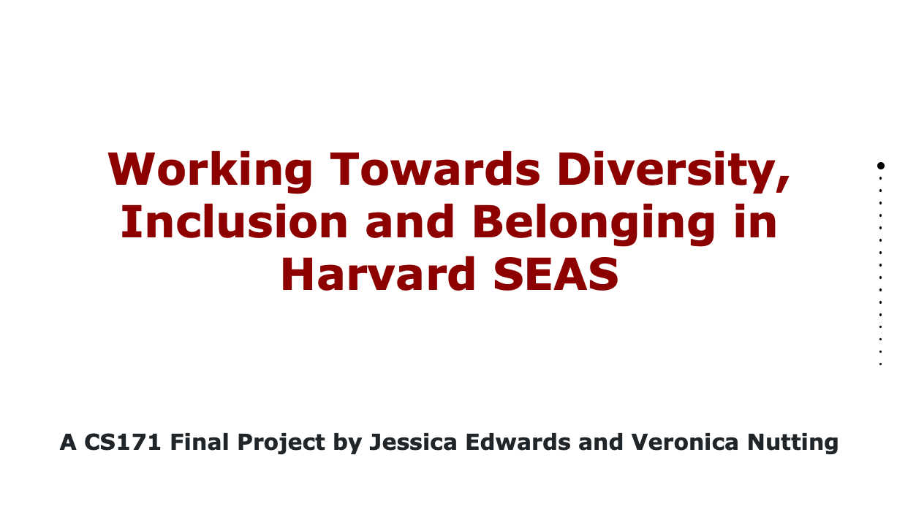
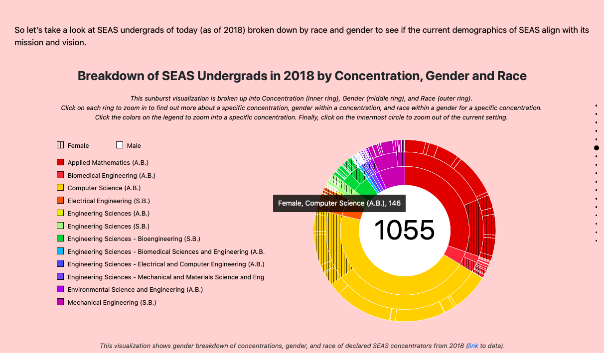
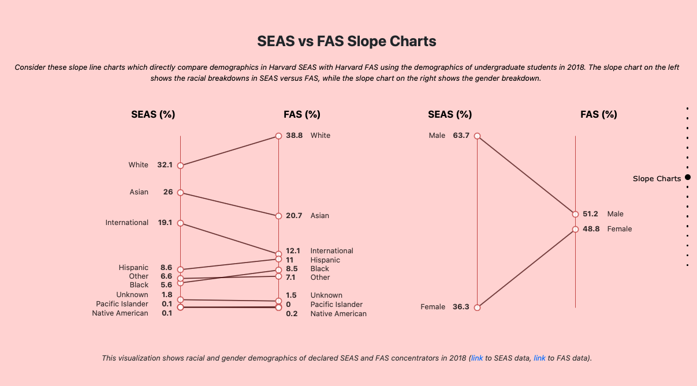

# Working Towards Diversity, Inclusion and Belonging in Harvard SEAS

[Link](https://veronicanutting.github.io/seas-diversity-data/) to project website 

**About the Project:**

This project aims to visualize data in order to analyze representation and retention data within the School of Engineering and Applied Sciences at Harvard University. Understanding issues relating to DIB, especially in regards to representation in technology, is necessary for informed and effective policy-making. Displaying historical and present-day demographic breakdowns within concentrations and schools can be useful for identifying trends and making sense of the current situation.

**About the Data:**

* From the [American Society of Engineering Education (ASEE)](http://profiles.asee.org/profiles/8130/screen/1?school_name=Harvard+University)
  * “A Decade of SEAS Undergrads” Visualization uses: Undergraduate, Enrollment by Class, for years 2007 to 2018
  * “Breakdown of SEAS Undergrads in 2018” Visualization uses: Undergraduate, Enrollment by Class, 2018
  * “SEAS vs FAS Slope Charts” uses: Undergraduate, Enrollment by Class, 2018
* From [Harvard Office of Institutional Research Factbook (OIR)](https://oir.harvard.edu/fact-book)
  * “SEAS vs FAS Slope Charts” uses: Student Headcount: Fall 2018; [Student Enrollment by Ethnicity](https://oir.harvard.edu/fact-book/enrollment): Fall 2018
  * “SEAS vs College Concentrations Over Time” uses: [Degrees Awarded: Harvard College Concentrations](https://oir.harvard.edu/fact-book/degrees-awarded-college), contains 2010-11 through 2014-15; [Degrees Awarded, Harvard College Concentrations](https://oir.harvard.edu/fact-book/degrees-awarded-summary) (2018-19); For 2015-16, 2016-17, and 2017-18, we had to contact OIR over email to get datasets
* All the data we used can be found in our Webstorm Project code (in the folder called “data”). 

**About the Code:**

`/Images`

We cite all the images we use in the html (right before their source tags).
We also have screenshots of sketches that correspond to our original visualization in this folder. (We originally used them as placeholders).

`/CSS`

Ours: styles.css; All others are not ours and are cited at the beginning of the file

`/JS `

Files and code are generally cited as needed.
Our visualizations are coded mainly in the following files:
* genderBarChart.js - “A Decade of SEAS Undergrads”
* sunburst.js - “Breakdown of SEAS Undergrads in 2018”
* stackarea.js - “SEAS vs College Concentrations Over Time”
* slopegraph.js and slopegraph2.js - “SEAS vs FAS Slope Charts”

Additionally, we initialize our “fullpage” layout (using fullpage.js which is not ours and is cited as such) in a file we created called layout-setup.js (which adapts code from the “fullpage” documentation and we cite this).

